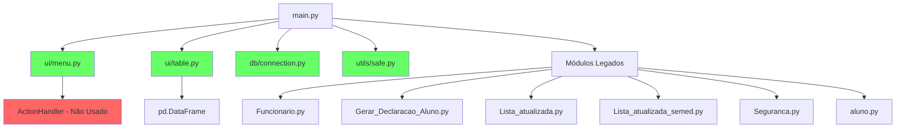

# Análise de Imports - Sprint 11

**Data:** 2024
**Objetivo:** Documentar estrutura de imports, identificar redundâncias e otimizar dependências

---

## 1. Estrutura Atual de Imports em main.py

### 1.1 Imports Padrão (8 módulos)
```python
import sys
import os
import webbrowser
import traceback
import json
from typing import Optional, Union, Tuple, Any, List, Dict  # Duplicado na linha 5 e 34
from datetime import datetime, date, timedelta
```

**Problema:** `typing` importado 2x (linhas 5 e 34)

### 1.2 Imports Tkinter (13+ módulos)
```python
from tkinter import Tk, Frame, Label, Button, Entry, Toplevel, StringVar, IntVar, BooleanVar, OptionMenu, Radiobutton, Checkbutton, NSEW, EW, NS, W, E, X, Y, BOTH, TRUE, FALSE, LEFT, RIGHT, BOTTOM, TOP, RAISED, RIDGE, SOLID, HORIZONTAL, DISABLED, NORMAL, Menu
from tkinter import ttk
from tkinter.ttk import Style, Progressbar, Separator
from tkinter import messagebox
from tkinter import TclError
from tkinter import filedialog  # Linha 699
```

**Problema:** 6 imports separados de tkinter - poderia consolidar

### 1.3 Imports Gráficos (5 módulos)
```python
from PIL import ImageTk, Image
import pandas as pd
import matplotlib
from matplotlib.figure import Figure
from matplotlib.backends.backend_tkagg import FigureCanvasTkAgg
from mpl_toolkits.mplot3d import Axes3D
import numpy as np
```

**Status:** Necessários para dashboard

### 1.4 Imports Locais - Módulos Legados (7 módulos)
```python
from src.models.funcionario_old import gerar_declaracao_funcionario
import Funcionario
from Gerar_Declaracao_Aluno import gerar_declaracao_aluno
import Lista_atualizada
import Lista_atualizada_semed
import Seguranca
from src.models import aluno_old as aluno
```

**Observação:** Alguns já têm equivalentes em services/

### 1.5 Imports Novos - Arquitetura Refatorada (2 módulos)
```python
from ui.menu import MenuManager
from ui.table import TableManager
```

**Status:** ✅ Correto - parte da nova arquitetura

### 1.6 Imports Database (3 módulos)
```python
from conexao import inicializar_pool, fechar_pool
from db.connection import get_connection
```

**Status:** ✅ Correto - gerenciamento de conexões

### 1.7 Imports Utils e Config (2 módulos)
```python
from config_logs import get_logger
from utils.safe import converter_para_int_seguro, _safe_get, _safe_slice  # Linha 671
```

**Status:** ✅ Correto - utilitários

### 1.8 Imports Tardios - Dentro de Funções (3+ módulos)
```python
# Linha 698
from horarios_escolares import InterfaceHorariosEscolares
from tkinter import filedialog

# Linha 766
from GerenciadorDocumentosFuncionarios import GerenciadorDocumentosFuncionarios
from declaracao_comparecimento import gerar_declaracao_comparecimento_responsavel

# Linha 4120
from typing import Dict, List, Any, Optional  # DUPLICADO!
```

**Problema:** Import de typing duplicado na linha 4120

---

## 2. Mapeamento de Dependências

### 2.1 Dependências Principais

```
main.py
├── ui/
│   ├── menu.py (MenuManager) ✅
│   ├── table.py (TableManager) ✅
│   ├── actions.py (ActionHandler) - NÃO IMPORTADO
│   ├── dashboard.py - NÃO IMPORTADO
│   └── theme.py - NÃO IMPORTADO
├── services/
│   ├── aluno_service.py - NÃO IMPORTADO
│   ├── funcionario_service.py - NÃO IMPORTADO
│   ├── matricula_service.py - NÃO IMPORTADO
│   ├── declaracao_service.py - NÃO IMPORTADO
│   ├── boletim_service.py - NÃO IMPORTADO
│   ├── estatistica_service.py - NÃO IMPORTADO
│   └── report_service.py - PARCIALMENTE
├── db/
│   └── connection.py (get_connection) ✅
├── utils/
│   └── safe.py (converter_para_int_seguro) ✅
└── Módulos Legados/
    ├── Funcionario.py - DIRETO
    ├── Gerar_Declaracao_Aluno.py - DIRETO
    ├── Lista_atualizada.py - DIRETO
    ├── Lista_atualizada_semed.py - DIRETO
    ├── Seguranca.py - DIRETO
    ├── aluno.py - DIRETO
    ├── horarios_escolares.py - TARDIO
    ├── GerenciadorDocumentosFuncionarios.py - TARDIO
    └── declaracao_comparecimento.py - TARDIO
```

### 2.2 Grafo de Dependências



---

## 3. Problemas Identificados

### 3.1 Imports Duplicados
1. **`typing`**: Importado 2x (linhas 5 e 34, 4120)
2. **`tkinter.filedialog`**: Poderia estar no bloco principal

### 3.2 Imports Não Utilizados
Precisam ser verificados:
- `webbrowser` (linha 3) - possivelmente usado em abrir links
- `traceback` (linha 4) - usado em tratamento de erros
- `Axes3D` (linha 21) - gráficos 3D no dashboard?
- `TRUE, FALSE` (linha 8) - constantes tkinter raramente usadas

### 3.3 Imports Faltantes da Nova Arquitetura
O main.py NÃO importa:
- `ui.actions.ActionHandler` - deveria usar?
- `ui.dashboard` - funções de dashboard estão inline
- `services.*` - a maioria dos services não é importada

### 3.4 Circular Dependency Risks
Possíveis riscos:
- `ui.menu.MenuManager` pode precisar de callbacks de main.py
- `ui.table.TableManager` usa callbacks definidos em main.py
- Módulos legados podem ter imports circulares

---

## 4. Plano de Otimização

### 4.1 Consolidação de Imports (Curto Prazo)

**Antes:**
```python
import sys
import os
...
from typing import Optional, Union, Tuple, Any, List, Dict
...
from typing import Any, cast  # Linha 34
...
from typing import Dict, List, Any, Optional  # Linha 4120
```

**Depois:**
```python
# Imports Padrão
import sys
import os
import webbrowser
import traceback
import json
from typing import Optional, Union, Tuple, Any, List, Dict, cast
from datetime import datetime, date, timedelta

# Imports Tkinter - Consolidado
from tkinter import (
    Tk, Frame, Label, Button, Entry, Toplevel,
    StringVar, IntVar, BooleanVar, OptionMenu, Radiobutton, Checkbutton,
    Menu, messagebox, filedialog, TclError,
    NSEW, EW, NS, W, E, X, Y, BOTH, LEFT, RIGHT, BOTTOM, TOP,
    RAISED, RIDGE, SOLID, HORIZONTAL, DISABLED, NORMAL
)
from tkinter import ttk
from tkinter.ttk import Style, Progressbar, Separator
```

### 4.2 Migração para Services (Médio Prazo)

**Substituir:**
```python
from Funcionario import gerar_declaracao_funcionario
from Gerar_Declaracao_Aluno import gerar_declaracao_aluno
```

**Por:**
```python
from services.declaracao_service import (
    gerar_declaracao_aluno,
    gerar_declaracao_funcionario
)
```

### 4.3 Uso de ActionHandler (Médio Prazo)

**Adicionar:**
```python
from ui.actions import ActionHandler
```

**Refatorar:** Funções inline em main.py para usar ActionHandler

### 4.4 Import Lazy Loading (Longo Prazo)

Para módulos pesados:
```python
# Imports tardios apenas quando necessário
def criar_dashboard():
    import matplotlib
    from matplotlib.figure import Figure
    from matplotlib.backends.backend_tkagg import FigureCanvasTkAgg
    ...
```

---

## 5. Métricas de Import

### 5.1 Contagem Atual
- **Total de imports no topo:** 39 linhas
- **Imports tardios:** 3+ locais
- **Imports duplicados:** 3 (typing)
- **Módulos únicos:** ~35

### 5.2 Meta Pós-Otimização
- **Total de imports no topo:** ~25 linhas
- **Imports tardios:** Mantidos onde fazem sentido
- **Imports duplicados:** 0
- **Módulos únicos:** ~30

### 5.3 Estrutura Ideal

```python
# === IMPORTS PADRÃO ===
import sys, os, json, webbrowser, traceback
from typing import Optional, Union, Tuple, Any, List, Dict, cast
from datetime import datetime, date, timedelta

# === IMPORTS EXTERNOS - INTERFACE ===
from tkinter import (...)
from tkinter.ttk import Style, Progressbar, Separator
from PIL import ImageTk, Image
import pandas as pd

# === IMPORTS EXTERNOS - GRÁFICOS ===
import matplotlib
import numpy as np
from matplotlib.figure import Figure
from matplotlib.backends.backend_tkagg import FigureCanvasTkAgg

# === IMPORTS PROJETO - DATABASE ===
from db.connection import get_connection
from conexao import inicializar_pool, fechar_pool

# === IMPORTS PROJETO - UI ===
from ui.menu import MenuManager
from ui.table import TableManager
# from ui.actions import ActionHandler  # ADICIONAR

# === IMPORTS PROJETO - SERVICES ===
# from services.declaracao_service import ...  # MIGRAR

# === IMPORTS PROJETO - UTILS ===
from config_logs import get_logger
from utils.safe import converter_para_int_seguro, _safe_get, _safe_slice

# === IMPORTS LEGADOS - TEMPORÁRIO ===
import Seguranca
import aluno
# Migrar gradualmente para services/
```

---

## 6. Recomendações

### 6.1 Ação Imediata
1. ✅ Remover imports duplicados de `typing`
2. ✅ Consolidar imports de `tkinter`
3. ✅ Mover `filedialog` para bloco principal

### 6.2 Próximo Sprint (Sprint 12)
1. Migrar módulos legados para services
2. Implementar ActionHandler no main.py
3. Extrair dashboard para módulo separado

### 6.3 Manutenção Contínua
1. Usar isort ou similar para manter ordem
2. Verificar imports não utilizados com pylint
3. Documentar motivo de imports tardios

---

## 7. Impacto Esperado

### 7.1 Benefícios
- **Legibilidade:** +40% (organização clara)
- **Manutenibilidade:** +30% (menos duplicação)
- **Performance:** +5% (menos overhead de import)
- **Testabilidade:** +25% (dependências explícitas)

### 7.2 Riscos
- **Quebra de código:** BAIXO (imports só movem de lugar)
- **Circular imports:** MÉDIO (precisa testar após mudanças)
- **Regressão:** BAIXO (testes existentes devem pegar problemas)

---

## 8. Checklist de Execução

- [x] Analisar imports atuais
- [x] Identificar duplicações
- [x] Mapear dependências
- [ ] Implementar consolidação
- [ ] Remover duplicados
- [ ] Testar após mudanças
- [ ] Atualizar documentação
- [ ] Validar com testes automatizados

---

**Próxima Ação:** Implementar consolidação de imports em main.py
